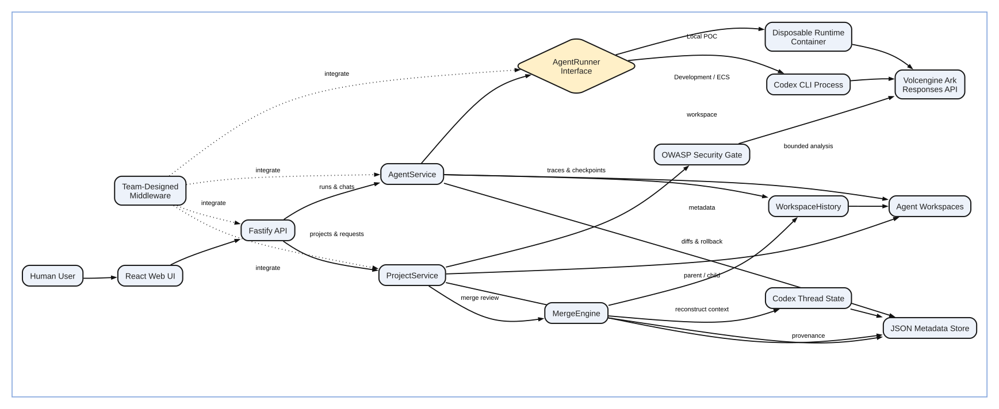

# Volc Agent Launchpad

A minimal Agent platform for three-day middleware hackathons. It provides Agent
CRUD, a browser Playground, persistent workspaces, and Codex CLI backed by the
Volcengine Ark Responses API.

Run it locally with Docker, Colima, or rootless Podman, or deploy it to
Volcengine ECS.

> [!WARNING]
> This is a multi-user hackathon proof of concept with demo-grade identity,
> server-side authorization, audit records, and observable execution tracing.
> A name is not a secure login and Runtime containers are not hardened tenant
> isolation. Do not use production data or credentials. See
> [SECURITY.md](SECURITY.md).

## Features

- React and TypeScript Web UI
- Agent create, edit, start, stop, delete, and multi-turn chat
- Individual and collaboration-project modes with owner/member authorization
- One-way standalone-Agent upgrade into a project parent, preserving files,
  history, branches, and Codex threads
- Parent and per-member child Agents with isolated project workspaces
- BranchPoint traces, named and automatic checkpoints, diffs, restoration, and
  branches
- Dynamic live website preview for HTML pages and built web apps, including
  branch selection, refresh, and expanded preview mode
- Downloadable project ZIPs with a generated README for running the exported
  project locally
- Advisory member-workspace security scans and owner-reviewed commit requests
- Causal three-way merge review with code-linked prompt provenance and
  reconstructed Codex context
- Fastify control plane with asynchronous Run state
- Persistent Agent workspaces and Codex sessions
- Disposable Docker, Colima, or Podman container for each local turn
- Docker and Terraform deployment paths for Volcengine ECS

## Screenshots

### Agent Playground


### Create an Agent


## Quick start

### Requirements

- Node.js 22+
- npm 10+
- Docker, Colima, or Podman
- A Volcengine Ark API key and endpoint that supports the Responses API

Codex CLI is included in the Runtime image and is not required on the host for
the local POC.

### Run the local POC

Install dependencies and start the application:

```bash
npm ci
ARK_API_KEY=your-ark-api-key \
ARK_MODEL=ep-your-endpoint-id \
npm run poc
```

The script automatically selects Docker, Colima, or Podman and builds the
Runtime image on the first run. Open <http://localhost:3000>.

For disposable repeatable state, set a separate data root:

```bash
LOCAL_POC_DATA_ROOT=/tmp/branchpoint-demo \
ARK_API_KEY=your-ark-api-key \
ARK_MODEL=ep-your-endpoint-id \
npm run poc
```

In the Web UI:

1. Enter a demo user name and select **Continue**.
2. In Individual mode, select **Create Agent**.
3. Enter a name, description, and workspace instructions.
4. Enter a task in the Playground, for example:

   ```text
   Create a TypeScript hello-world CLI, add a test, and run it.
   ```

The Agent can write files, run commands, and continue the same Codex session in
later messages.

## Workspace output

The Workspace output appears after the selected Agent workspace contains a
previewable web entry. It stays hidden when the workspace has no HTML page or
built web app, so non-web tasks do not produce an empty preview panel.

Preview discovery supports the following entry files, in priority order. These
must be files, not directories:

- `dist/index.html`
- `build/index.html`
- `index.html`
- `public/index.html`

An actual file named `index.html` is supported. A directory named
`index.html` is ignored because it cannot be rendered as a web page.

If none of those exists, the server searches the workspace for other `.html`
files while excluding platform-managed directories such as `branches/`,
`.git/`, and `node_modules/`. A built app is previewable when its build output
contains an HTML entry file.

When a preview is available:

- Use the workspace selector to preview the Agent's main workspace or a
  specific BranchPoint branch.
- Use **Refresh** to reload the current entry file after workspace changes.
- Use **Expand** to open the preview in a larger modal view.

The preview is served through the authenticated API, and relative HTML assets
are routed through the same selected workspace. The preview status is checked
again when the Agent or selected branch changes.

## Downloading a project

Select **Download ZIP** in the Agent controls to export the Agent's main
workspace. The archive contains the project source and configuration needed to
run it locally, plus a generated `README.md` containing setup and start
instructions.

Dependencies, generated output, BranchPoint state, platform-managed
`AGENTS.md`, credentials, and environment files are intentionally excluded.
After extracting the archive, install the project's dependencies with
`npm install` and use the command documented by its generated README and
`package.json`. Branch changes should be merged into the Agent's main workspace
before downloading if they need to be included in the export.

### Stop and resume

Press `Ctrl+C` in the startup terminal. Temporary Runtime containers are
removed, while Agent workspaces and conversations are kept.

- macOS state: `~/.volc-agent-launchpad/`
- Linux state: `.local/`
- Custom location: set `LOCAL_POC_DATA_ROOT`

Run the same `npm run poc` command to continue later.

### Select a container engine

Force Podman when multiple engines are installed:

```bash
CONTAINER_ENGINE=podman \
ARK_API_KEY=your-ark-api-key \
ARK_MODEL=ep-your-endpoint-id \
npm run poc
```

Colima uses `CONTAINER_ENGINE=docker` because it exposes the Docker CLI. For a
clean Linux host, follow the
[rootless Podman setup](docs/LOCAL_POC.md#rootless-podman-on-linux).

## Development

Host-process development is available with:

```bash
npm install
cp .env.example .env
npm install --global @openai/codex@0.111.0
```

The development scripts do not load `.env` automatically. Export its values in
the current shell before starting the host-process server:

```bash
set -a
. ./.env
set +a
npm run poc
```

- Web UI: <http://localhost:5173>
- API: <http://localhost:3000>

Use local paths in `.env` when running outside Docker:

```dotenv
APP_DATA_DIR=.data
AGENT_WORKSPACE_ROOT=workspaces
CODEX_HOME=codex-home
```

## Docker Compose

Create and edit the configuration:

```bash
./scripts/bootstrap-local.sh
```

Required values in `.env`:

```dotenv
ARK_API_KEY=your-ark-api-key
ARK_MODEL=ep-your-endpoint-id
APP_AUTH_TOKEN=replace-with-at-least-24-random-characters
```

Start and stop the application without deleting Agent data:

```bash
docker compose up --build
docker compose down
```

Open <http://localhost:3000> after the services start.

## Architecture and runtime flow



The editable diagram source is
[docs/branchpoint-architecture.mmd](docs/branchpoint-architecture.mmd).
The `branchpoint-architecture.mmd` and `.svg` files are the canonical current
architecture artifacts. Older `current-architecture` files are retained as
historical artifacts and are not the diagrams referenced by this documentation.

The first turn uses `codex exec`; later turns resume the stored Codex thread.
The browser stores the current demo user's generated bearer token locally and
sends it to the API. The API resolves that user, then `AgentService` and
`ProjectService` enforce ownership and project-role decisions. BranchPoint
records observable Runtime events and filesystem-derived checkpoints without
capturing hidden chain-of-thought.

Deleting an Agent archives its workspace under `workspaces/.deleted/`.
Project workspaces are stored under `workspaces/projects/<project-id>/`, with
parent branches under `main/branches/` and member branches under the relevant
member workspace's `branches/` directory.

See [docs/ARCHITECTURE.md](docs/ARCHITECTURE.md) for component and extension
boundaries.

## BranchPoint middleware

This repository contains the complete BranchPoint middleware implementation
after the supplied Agent Launchpad starter kit. It makes Agent work observable,
recoverable, branchable, reviewable, and safe to hand off across isolated
workspaces.

### Middleware problem and rationale

The starter kit can run an Agent and persist its conversation, but
collaboration needs stronger guarantees. A file diff does not identify the
prompt and Run that caused it; failed turns need recoverable states; branches
must not leak workspace or context; members must not publish directly to the
owner's main; security approvals must become stale after a workspace change;
and merged code must not create a misleading next-turn conversation.

BranchPoint treats the filesystem as authoritative, captures immutable
checkpoint state, enforces authorization in the backend, gates member handoff
with a hash-bound OWASP review, performs a causal three-way merge, and records
visible provenance for code that combines both sides.

### Design summary

The starter baseline remains: Agent CRUD and lifecycle, Playground chat,
persistent messages/Runs/workspaces, Codex threads, host-process execution,
disposable local Runtime execution, bounded output/time, cancellation, and
resumable turns.

BranchPoint adds:

- Observable `codex exec --json` traces, Run state, filesystem changes,
  checkpoints, completion, errors, and authenticated SSE streaming without
  storing hidden chain-of-thought.
- Deterministic workspace manifests using file paths, sizes, modes, and
  SHA-256 hashes; created/modified/deleted diffs; automatic and named
  immutable checkpoints; checkpoint details; and bounded file comparisons.
- Staged, hash-verified restoration with recovery copies, platform-directory
  preservation, and rollback on publication failure.
- Independent checkpoint branches with isolated workspace state, lineage,
  Runs, messages, and Codex sessions. Usable Codex rollout metadata is forked
  at the checkpoint offset; otherwise a fresh thread is used safely.
- Collaboration projects with an owner-controlled parent Agent, isolated
  child Agent per active member, membership/invitation management, roles,
  activity, archive/unarchive, transfer, deletion, and standalone-Agent
  upgrade that preserves identity and history.
- Server-side authorization and audit records. A member owns and may merge its
  child branch into child main; only the project owner may merge child work
  into the parent main or decide a commit request.
- OWASP Top 10 security analysis over bounded changed files, zero-token static
  findings, direct model classification without Agent tools/history, safe
  full-file auto-fix, and workspace-hash invalidation.
- Commit requests whose clean owner approval uses the shared merge engine and
  atomically marks the request `merged`; conflicts return a preview and remain
  `pending`; rejection changes only status.
- Causal prompt conflicts based on actual conflicting file changes and prompt
  attribution through Run checkpoints. Wording, shared anchors, unrelated
  files, and code-free prompts do not create prompt conflicts.
- Strict AI resolution: a side is legal only when it satisfies every
  acceptance criterion; otherwise AI must return `COMBINED` with a complete
  file body, merge instruction, and explanation.
- Target/source choices preserve the corresponding prompts. Mixed or clean
  two-sided results preserve attributed prompts and record merge provenance.
  Merge-history events are shown in the UI but are excluded from native Codex
  prompts.
- Reconstructed merged threads use selected real prompts/responses and
  explicitly inherit the merged workspace as their `cwd`.

## Validation and demo

### Automated checks

Run the main verification gate:

```bash
npm run check
```

Optional deployment/configuration checks:

```bash
terraform fmt -check -recursive deploy/volcengine
docker compose config
```

The automated gate runs server/Web TypeScript checks, Web/API production
builds, and the server Vitest suite. It covers Agent lifecycle, traces,
checkpoints, restore, branches, session forking, projects, authorization,
audit, security analysis, commit requests, clean/conflicting approvals,
rollback, causal attribution, strict AI criteria, provenance, and
reconstructed-thread workspace inheritance. The tests use fixtures and mocks
and do not require Ark credentials, network access, or a running Docker daemon.

### Demo walkthrough

1. Run an Agent task that changes a file and inspect its trace and automatic
   checkpoint.
2. Save a named checkpoint, make another change, compare states, and restore
   the earlier checkpoint.
3. Create a branch, run a different task, and show independent files, history,
   and Codex context.
4. Create a project and member. Verify child-owner branch-to-child-main merge
   access and project-owner-only child-to-parent merge access.
5. Run the member OWASP check, submit a commit request, and approve a clean
   request as the owner.
6. Prepare a same-file conflict, approve it, observe progress into merge
   review, and resolve it by target/source or AI `COMBINED` output.
7. Show the resulting workspace, provenance, application history, and
   reconstructed thread path. Reject another request and verify no files
   change.

## Deployment

- [Existing Linux ECS with Docker](docs/DEPLOYMENT.md#existing-linux-ecs)
- [Complete Volcengine environment with Terraform](docs/DEPLOYMENT.md#terraform-deployment)
- [Local Docker, Colima, and Podman details](docs/LOCAL_POC.md)

The existing-ECS script deploys from the current source tree:

```bash
cp .env.example .env.production
./scripts/deploy-existing-ecs.sh .env.production
```

The Terraform path provisions VPC, subnet, security group, ECS, and EIP:

```bash
cp deploy/volcengine/terraform.tfvars.example \
  deploy/volcengine/terraform.tfvars
./scripts/deploy-volcengine.sh
```

## Configuration

| Variable | Default | Purpose |
| --- | --- | --- |
| `ARK_API_KEY` | Required | Ark model API key. |
| `ARK_MODEL` | Required | Responses-capable endpoint or model ID. |
| `ARK_BASE_URL` | Beijing v3 endpoint | Ark OpenAI-compatible API URL. |
| `APP_AUTH_TOKEN` | Empty on loopback | Legacy deployment guard required by non-loopback production configuration. It is not a user login token and is not accepted by the current API authorization hook. |
| `RUNTIME_PROVIDER` | `local-process` | `container` for disposable local Runtime containers. |
| `CODEX_SANDBOX_MODE` | `workspace-write` | Codex inner sandbox mode. |
| `CODEX_TIMEOUT_MS` | `600000` | Maximum duration of one turn. |
| `LOCAL_POC_DATA_ROOT` | Platform-specific | Local metadata, workspace, and session directory. |

See [.env.example](.env.example) for all Runtime and resource-limit options.

## Limitations and secret handling

- Demo identity and generated bearer tokens are not production authentication.
- `JsonStore` is single-process JSON persistence, not a distributed database.
- Runtime containers are resource-limited but not hardened tenant isolation.
- The OWASP gate is a focused pre-commit control, not a complete security
  audit.
- Codex rollout files are append-oriented, so merged context requires a new
  thread rather than surgical edits to an old native transcript.
- Reconstruction is best-effort when rollout files or offsets are unavailable.
- The POC has no distributed locks, remote object storage, or hosted multi-node
  collaboration.

Never commit Ark API keys, bearer tokens, `.env` files, private keys, Docker
credentials, or production data. Use [.env.example](.env.example) and
placeholders such as `your-ark-api-key`. Keep credentials server-side or in an
external secret manager; the browser never receives the Ark API key. Do not
display credentials, browser storage, or authorization headers during a
demonstration.

## Documentation

- [Architecture](docs/ARCHITECTURE.md)
- [Testing and automated verification](docs/TESTING.md)
- [Local POC](docs/LOCAL_POC.md)
- [Deployment](docs/DEPLOYMENT.md)
- [Hackathon extension guide](docs/HACKATHON_EXTENSION_GUIDE.md)
- [Security policy](SECURITY.md)
- [Contributing](CONTRIBUTING.md)

## License

[MIT](LICENSE)
