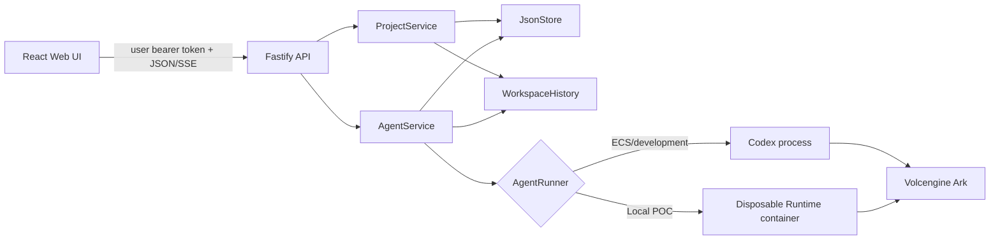

# Architecture

Volc Agent Launchpad is a single-node control plane with two product modes:
standalone Agents for individual work and collaboration projects containing one
owner-controlled parent Agent plus one child Agent per member.



## Responsibility boundaries

### React Web UI

The UI selects a demo user, stores that user's generated bearer token in browser
local storage, renders Individual and Collaboration modes, and calls the API.
It may hide unavailable controls for usability, but it is not trusted to enforce
ownership or project roles. The Ark API key is never returned to the browser.

### Fastify API

The API is the protocol boundary. It validates route parameters and bodies,
resolves bearer tokens to users, enforces a one-megabyte body limit, and maps
service errors to HTTP responses. Public access is limited to health/auth
discovery and demo-user creation. Resource routes resolve the owning Agent or
project before invoking service-layer authorization.

`APP_AUTH_TOKEN` is legacy deployment configuration and is not the bearer token
accepted by this hook. API requests use the generated `User.token` value.

### AgentService

`AgentService` owns Agent lifecycle, Agent ownership decisions, asynchronous Run
state, messages, Codex thread IDs, trace subscriptions, checkpoints, branches,
restoration, and audit entries for Agent decisions. Project owners may access
Agents in their project; members may access only their own child Agent.

```text
ready -> busy -> ready
  |       |
  v       v
stopped  error
```

Only one Run is admitted for a main Agent workspace or individual branch at a
time. A stopped Agent rejects prompts. On restart, interrupted Runs become
`cancelled` and busy Agents return to `ready`.

### ProjectService

`ProjectService` owns project membership and the owner/member/member-own policy
matrix. It creates the canonical `main` workspace and member copies, filters
roster data by role, protects main-tree reads from path traversal, freezes
project writes while archived, runs advisory security scans, calculates member
changes against main, persists commit-request decisions, and promotes a
standalone Agent into a new project's parent without changing that Agent's
identity, execution history, checkpoints, branches, or Codex threads. The
upgrade stages and verifies a project workspace copy before atomically
publishing the new project metadata.

Security checks report findings but do not currently block a commit request.
Approving a commit request records the decision; it does not yet apply or merge
the member workspace into `main`.

### WorkspaceHistory and BranchPoint

The filesystem is authoritative for workspace state. `WorkspaceHistory` hashes
file paths, content, mode, and size before and after a Run. Meaningful changes
produce immutable snapshots and checkpoints through staging-directory creation
followed by atomic rename. Branch directories are platform state and are
excluded from recursive manifests.

BranchPoint stores observable events from `codex exec --json`, verified
workspace mutations, bounded output metadata, and user/assistant messages. It
does not store private hidden chain-of-thought. Creating a branch restores the
selected snapshot into an independent workspace and, when the recorded Codex
rollout is available, forks the session transcript at the checkpoint offset.

### JsonStore

`JsonStore` serializes mutations through one in-process queue and persists a
single JSON database using a temporary file and replacement. It is designed for
one control-plane process, not concurrent writers or multi-node deployment.

### Runtime providers

- `ContainerCodexRunner` starts one disposable Docker/Podman-compatible
  container per local turn.
- `CodexRunner` starts Codex as a child process for local development or ECS.

Both use argv-based process execution, bounded output and duration, resumable
thread IDs, cancellation, and termination escalation. The local container path
adds resource limits, drops capabilities, enables `no-new-privileges`, and bind
mounts only the selected workspace and Codex home.

## Data crossing each boundary

| Boundary | Data crossing it | Failure behavior |
| --- | --- | --- |
| Browser → API | User token, validated JSON, resource IDs | `401` for missing/invalid token; `400`/`413` for invalid or oversized input |
| API → authorization services | Resolved user, action, Agent/project/member ID | `403` denial with an audit record; `409` when archived or otherwise conflicting |
| AgentService → Runtime | Workspace path, prompt, sandbox mode, resumable thread ID | Run becomes failed/cancelled; partial workspace mutation can produce a partial checkpoint |
| Services → JsonStore | Structured metadata and audit records | Failed persistence is not published as committed in-memory state |
| Services → workspace/history | Files, manifests, hashes, snapshots | Missing resources return controlled errors; staging snapshots are removed on failure |
| Runtime → Ark | Model request and Ark credential through the server/Runtime environment | Configuration failure returns `503`; timeout/output/cancellation limits terminate the Run |

## Persistent layout

```text
data/launchpad.json
data/branchpoint/snapshots/<snapshot-id>/
data/branchpoint/restores/<checkpoint-id>-<timestamp>/
workspaces/<standalone-agent-id>/
  branches/<branch-id>/
workspaces/projects/<project-id>/
  main/
    branches/<parent-branch-id>/
  members/<member-id>/
    branches/<member-branch-id>/
workspaces/.deleted/
codex-home/
```

## Trust boundary and limitations

The POC trust boundary is the local host/container or ECS instance. Server-side
authorization prevents ordinary cross-user access through covered API routes,
but name-based persona resumption is not secure authentication and Runtime
containers are not hardened multi-tenant isolation. See [Security](../SECURITY.md).

## Deployment profiles

| Profile | Control plane | Agent execution |
| --- | --- | --- |
| Local POC | Host Node.js | Disposable local container |
| Local development | Host Node.js | Host Codex process |
| ECS | Application container | Codex process in the same container |

The local POC is the default judging path. ECS and Terraform are optional.
